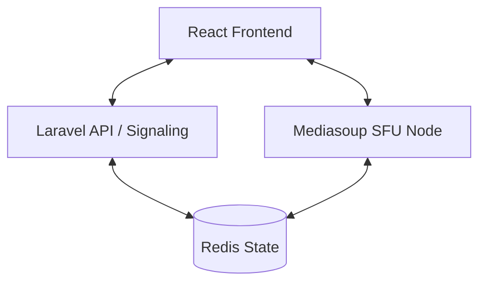

# SignalCore

SignalCore is an enterprise-scale, high-performance web-based video conferencing platform. It is designed to host 100+ concurrent users per room with sub-300ms latency, utilizing a Selective Forwarding Unit (SFU) architecture.

## 🚀 Key Features

- **Enterprise Scalability**: Supports >100 users per room.
- **Low Latency**: Sub-300ms glass-to-glass latency.
- **Adaptive Grid**: Dynamically prioritizes active speakers and adjusts layout based on participant count.
- **Intelligent Bandwidth Management**: Uses 3-layer Simulcast and Selective Forwarding to optimize performance.
- **Self-Hosted SFU**: Powered by **mediasoup** for raw media performance.
- **Robust Orchestration**: Managed by **Laravel** for signaling, authentication (JWT), and room lifecycle.

## 🏗️ Architecture

SignalCore uses a decoupled architecture to separate business logic from media processing:

- **Frontend**: React (Vite) + Tailwind CSS
- **API/Orchestration**: Laravel 12 (PHP 8.2+)
- **SFU (Media Server)**: Node.js + Mediasoup (C++ internals)
- **State/Metrics**: Redis (Real-time node health and room state)



## 🛠️ Tech Stack

- **Backend**: Laravel 12, PHP 8.2, MySQL/PostgreSQL
- **Real-time**: Mediasoup, Socket.io (or Laravel WebSockets)
- **Frontend**: React 18, TypeScript, Vite
- **Infrastructure**: Redis, Coturn (STUN/TURN)

## 📋 Prerequisites

- **PHP** >= 8.2
- **Node.js** >= 18
- **Composer**
- **Redis**
- **MySQL** or **PostgreSQL**
- **Build Tools** (gcc, g++, make for mediasoup compilation)

## 🔧 Installation

### 1. API (Laravel)
```bash
cd api
composer install
cp .env.example .env
php artisan key:generate
php artisan migrate --seed
php artisan serve --port=8000
```

### 2. SFU (Media Server)
```bash
cd sfu
npm install
# Ensure you have build tools installed for mediasoup
npm start
```

### 3. Client (React)
```bash
cd client
npm install
npm run dev
```

## 🔒 Security

- **JWT Authentication**: Secure signaling access.
- **RS256 Signing**: Laravel signs tokens, SFU verifies them with public keys.
- **DTLS-SRTP**: Fully encrypted media streams.

## 📄 License

Proprietary / Enterprise.

---
Built with ❤️ for High-Performance Communication.
