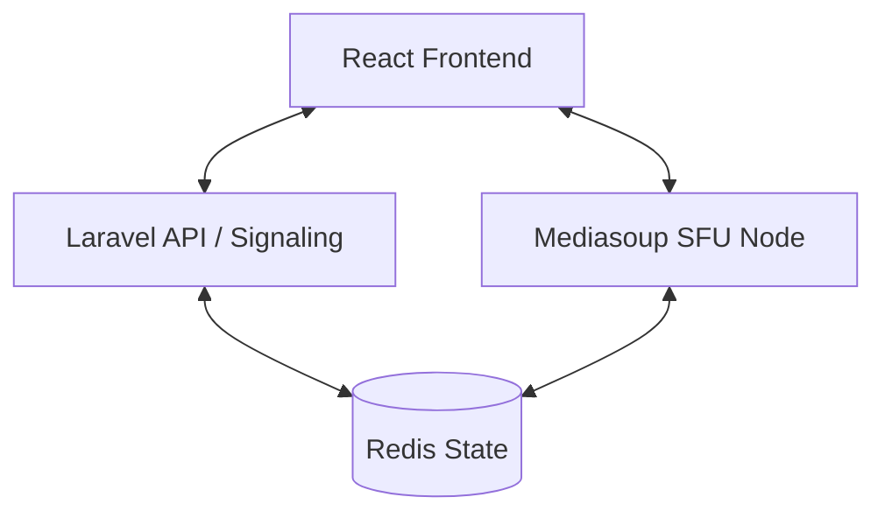

# SignalCore

SignalCore adalah platform video conferencing berbasis web skala enterprise dengan performa tinggi. Dirancang untuk menampung banyak pengguna konkuren dalam satu ruangan dengan latensi sangat rendah, menggunakan arsitektur Selective Forwarding Unit (SFU) yang canggih.

## 🚀 Fitur Utama & Optimasi Terbaru

- **Google Meet Style Layout**: Tata letak grid dinamis yang memastikan semua peserta tetap berada di pandangan utama. Peserta tanpa kamera akan ditampilkan dengan avatar inisial yang elegan, bukan kotak hitam.
- **Client-Side Recording**: Fitur perekaman rapat langsung dari browser. Hasil rekaman disimpan secara lokal dalam format `.webm` berkualitas tinggi tanpa membebani server.
- **Whiteboard Kolaboratif**: Papan tulis interaktif terintegrasi untuk kolaborasi visual secara real-time.
- **Antarmuka Profesional & Bersih**: Desain minimalis tingkat enterprise yang fokus pada kegunaan (usability) dan estetika premium.
- **Lokalisasi Bahasa Indonesia**: Antarmuka yang sepenuhnya dalam Bahasa Indonesia untuk kemudahan penggunaan lokal.
- **Latensi Rendah**: Latensi di bawah 300ms berkat optimasi **mediasoup** SFU.
- **Manajemen Bandwidth Cerdas**: Optimasi otomatis aliran media berdasarkan kondisi jaringan pengguna.

## 🏗️ Arsitektur Sistem

SignalCore memisahkan logika bisnis dari pemrosesan media untuk skalabilitas maksimal:

- **Frontend**: React (Vite) + Tailwind CSS + Zustand (State Management).
- **Orkestrator API**: Laravel 12 (Signaling, Autentikasi JWT, Manajemen Ruangan).
- **SFU Media Node**: Node.js + Mediasoup (Engine media berbasis C++).
- **State Synchronization**: Redis (Sinkronisasi metrik node dan status real-time).



## 🛠️ Stack Teknologi

- **Backend**: Laravel 12 (PHP 8.2+), MySQL/PostgreSQL.
- **Real-time Media**: Mediasoup (SFU), WebRTC.
- **Frontend**: React 18, TypeScript, Vite, Lucide Icons.
- **Infrastruktur**: Redis (Metrics & Pub/Sub), Coturn (STUN/TURN).

## 🔧 Panduan Instalasi & Pengembangan

### Prasyarat
- PHP >= 8.2 & Composer
- Node.js >= 18 & NPM
- Redis Server (Berjalan di port 6379)
- Build Tools (gcc, g++, make untuk kompilasi mediasoup)

### Langkah Jalankan Aplikasi

#### 1. Persiapan Redis
Pastikan layanan Redis sudah berjalan:
```bash
brew services start redis  # Untuk MacOS
```

#### 2. Menjalankan Backend (Laravel)
```bash
cd api
composer install
cp .env.example .env
php artisan key:generate
php artisan migrate --seed
php artisan serve --port=8000
```

#### 3. Menjalankan Media Server (SFU)
```bash
cd sfu
npm install
npm start
```

#### 4. Menjalankan Frontend (Client)
```bash
cd client
npm install
npm run dev
```

Akses aplikasi melalui: `http://localhost:5173`

## 🔒 Keamanan & Privasi

- **Autentikasi Ganda**: Menggunakan JWT untuk sesi aplikasi dan Token Media terenkripsi untuk akses SFU.
- **RS256 Signing**: Verifikasi token menggunakan kunci publik/privat antara Laravel dan SFU.
- **Enkripsi Media**: Seluruh aliran media menggunakan DTLS-SRTP untuk enkripsi end-to-end dalam transit.

## 📄 Lisensi

Proprietary / Enterprise.

---
Dibuat dengan ❤️ untuk Komunikasi Performa Tinggi oleh **SignalCore Team**.
