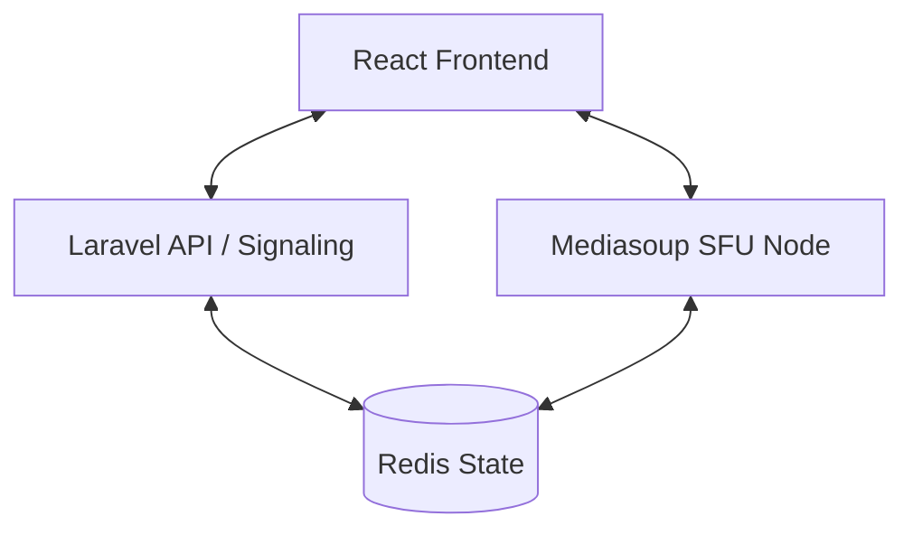

# SignalCore

SignalCore adalah platform video conferencing berbasis web skala enterprise dengan performa tinggi. Dirancang untuk menampung lebih dari 100 pengguna konkuren dalam satu ruangan dengan latensi di bawah 300ms, menggunakan arsitektur Selective Forwarding Unit (SFU).

## 🚀 Fitur Utama

- **Skalabilitas Enterprise**: Mendukung 100+ pengguna per ruangan.
- **Latensi Rendah**: Latensi glass-to-glass di bawah 300ms.
- **Grid Adaptif**: Secara dinamis memprioritaskan pembicara aktif dan menyesuaikan tata letak berdasarkan jumlah peserta.
- **Manajemen Bandwidth Cerdas**: Menggunakan Simulcast 3-lapis dan Selective Forwarding untuk mengoptimalkan performa.
- **SFU Self-Hosted**: Ditenagai oleh **mediasoup** untuk performa media mentah yang maksimal.
- **Orkestrasi Kuat**: Dikelola oleh **Laravel** untuk signaling, autentikasi (JWT), dan manajemen siklus hidup ruangan.

## 🏗️ Arsitektur

SignalCore menggunakan arsitektur yang terpisah (decoupled) untuk memisahkan logika bisnis dari pemrosesan media:

- **Frontend**: React (Vite) + Tailwind CSS
- **API/Orkestrasi**: Laravel 12 (PHP 8.2+)
- **SFU (Media Server)**: Node.js + Mediasoup (internal C++)
- **State/Metrik**: Redis (kesehatan node real-time dan state ruangan)



## 🛠️ Stack Teknologi

- **Backend**: Laravel 12, PHP 8.2, MySQL/PostgreSQL
- **Real-time**: Mediasoup, Socket.io (atau Laravel WebSockets)
- **Frontend**: React 18, TypeScript, Vite
- **Infrastruktur**: Redis, Coturn (STUN/TURN)

## 📋 Prasyarat

- **PHP** >= 8.2
- **Node.js** >= 18
- **Composer**
- **Redis**
- **MySQL** atau **PostgreSQL**
- **Build Tools** (gcc, g++, make untuk kompilasi mediasoup)

## 🔧 Instalasi

### 1. API (Laravel)
```bash
cd api
composer install
cp .env.example .env
php artisan key:generate
php artisan migrate --seed
php artisan serve --port=8000
```

### 2. SFU (Media Server)
```bash
cd sfu
npm install
# Pastikan build tools sudah terinstall untuk mediasoup
npm start
```

### 3. Client (React)
```bash
cd client
npm install
npm run dev
```

## 🔒 Keamanan

- **Autentikasi JWT**: Akses signaling yang aman.
- **Penandatanganan RS256**: Laravel menandatangani token, SFU memverifikasi dengan kunci publik.
- **DTLS-SRTP**: Aliran media yang terenkripsi penuh.

## 📄 Lisensi

Proprietary / Enterprise.

---
Dibuat dengan ❤️ untuk Komunikasi Performa Tinggi.
