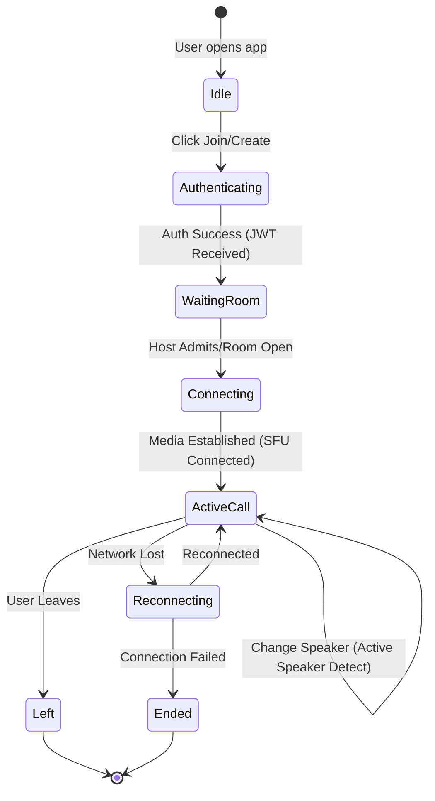
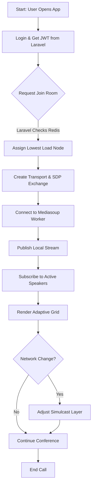
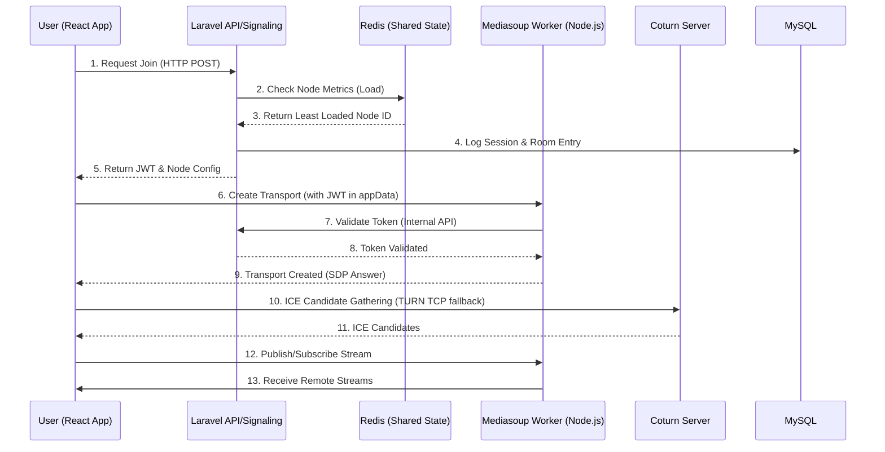
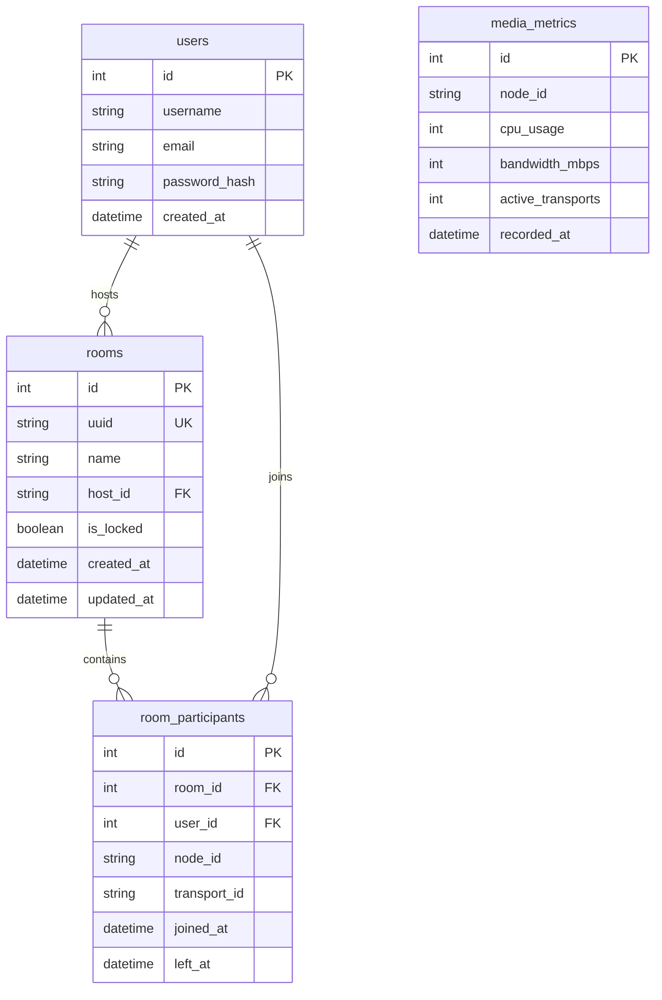

# PRD -- Project Requirements Document

## 1. Overview

**SignalCore** adalah platform video conferencing berbasis web skala enterprise yang dirancang untuk menampung minimal 100 pengguna konkuren dalam satu ruang (room) dengan latensi di bawah 300ms. Produk ini memanfaatkan arsitektur Selective Forwarding Unit (SFU) menggunakan **mediasoup** untuk mendistribusikan media secara efisien, di mana **Laravel** bertindak sebagai otak orkestrasi untuk signaling, autentikasi, dan manajemen siklus hidup room, sementara pemrosesan media berat didelegasikan sepenuhnya ke worker Node.js. Tujuan utamanya adalah menyediakan infrastruktur komunikasi real-time yang stabil, hemat bandwidth, dan dapat diskalakan secara horizontal tanpa bergantung pada layanan SaaS pihak ketiga.

Masalah utama yang diselesaikan oleh SignalCore adalah ketidakmampuan arsitektur mesh tradisional atau solusi SFU sederhana untuk menangani kapasitas tinggi (>50 user) tanpa degradasi performa yang parah, serta keterbatasan framework PHP seperti Laravel dalam memproses stream media secara native. Solusi yang ada sering kali gagal menyeimbangkan beban antar node atau tidak memiliki mekanisme "Active Speaker Detection" yang agresif, resulting in bandwidth exhaustion pada sisi klien. SignalCore mengatasi ini dengan strategi *Selective Forwarding* cerdas yang hanya mengirimkan video resolusi tinggi untuk 4-6 pembicara aktif, sementara peserta lain hanya menerima audio atau video resolusi rendah.

Target audiens utama adalah organisasi enterprise, institusi pendidikan, dan penyedia layanan telemedicine yang membutuhkan kedaulatan data (self-hosted) dan kontrol penuh atas infrastruktur komunikasi mereka. Nilai unik (Value Proposition) SignalCore terletak pada hibridisasi kekuatan ekosistem PHP/Laravel untuk logika bisnis yang kompleks dengan performa tinggi dari C++/Node.js (mediasoup) untuk media, didukung oleh mekanisme *Node Assignment* berbasis Redis real-time dan adaptasi grid frontend yang dinamis untuk memastikan pengalaman pengguna yang mulus bahkan di jaringan dengan bandwidth terbatas.

## 2. Requirements

- **Accessibility:** Sistem harus dapat diakses sepenuhnya melalui browser web modern (Chrome, Firefox, Safari, Edge) di desktop dan mobile tanpa instalasi plugin tambahan, menggunakan protokol HTTPS/WSS untuk keamanan.
- **User Roles:**
    - **Host:** Memiliki hak penuh untuk membuat room, mengunci room, mute-all participants, dan mengeluarkan (kick) peserta.
    - **Participant:** Dapat bergabung, mengaktifkan kamera/mikrofon, dan berinteraksi dalam room sesuai izin host.
    - **System Admin:** Mengakses dashboard monitoring untuk melihat metrik server (CPU, Bandwidth, Active Rooms) dan log kesehatan node.
- **Data Input:** Data utama masuk melalui API Laravel (pembuatan room, autentikasi user), signaling WebSocket (SDP, ICE candidates), dan stream media real-time dari perangkat klien (audio/video tracks).
- **Specificity:** Sistem harus melacak:
    - **Room Metadata:** ID Room, kapasitas maksimal, status (active/locked/closed), timestamp pembuatan.
    - **Participant State:** User ID, status mikrofon/kamera, kualitas koneksi (score), node SFU tempat terhubung, dan level simulcast yang aktif.
    - **Media Metrics:** Bitrate per stream, packet loss, jitter, dan CPU usage per worker node (disimpan di Redis).
- **Notification:** Sistem harus memberikan notifikasi real-time via WebSocket untuk事件 seperti "User Joined", "User Left", "Active Speaker Changed", dan peringatan sistem jika kualitas jaringan pengguna turun di bawah ambang batas.
- **Scalability & Resilience:** Arsitektur harus mendukung penambahan node mediasoup secara dinamis. Jika satu node gagal, user baru harus diarahkan ke node tersedia berikutnya tanpa interupsi pada room yang sedang berjalan (isolasi failure per node).

## 3. Core Features

1. **Orkestrasi Room & Penugasan Node Cerdas**
   - Laravel mengelola siklus hidup room dan menggunakan Redis untuk menyimpan metrik beban (CPU/Bandwidth) dari setiap worker node mediasoup secara real-time.
   - Saat user meminta "join", Laravel memilih node dengan beban terendah dan mengembalikan kredensial koneksi yang spesifik untuk node tersebut.
   - Mencegah overload single-node dengan ambang batas keras (hard limit) pada kapasitas per worker.

2. **Distribusi Media Selektif (Selective Forwarding & Simulcast)**
   - Mengaktifkan 3 layer simulcast (high, medium, low) pada sisi producer.
   - SFU secara otomatis menyesuaikan layer yang dikirim ke setiap consumer berdasarkan bandwidth tersedia mereka.
   - Strategi "Audio-Only for Background": Dalam room >10 user, peserta di luar 6 teratas hanya menerima stream audio dari peserta lain untuk menghemat bandwidth downlink.

3. **Deteksi Pembicara Aktif & Prioritas Grid Dinamis**
   - Mediasoup worker mendeteksi level volume audio dan mengirim event ke Laravel/Client.
   - Frontend React secara otomatis memindahkan video 4-6 pembicara teratas ke posisi utama grid.
   - Jika CPU browser klien tinggi, frontend secara otomatis mengurangi jumlah video yang dirender (misal: dari 100 menjadi hanya 4 video aktif, sisanya avatar statis).

4. **Keamanan Koneksi & Validasi Token Berbasis JWT**
   - Klien harus memperoleh JWT dari Laravel API sebelum inisiasi WebRTC.
   - Token ini divalidasi oleh worker mediasoup pada saat `createTransport`. Jika token tidak valid atau kadaluarsa, koneksi media ditolak langsung di level worker tanpa membebani Laravel.
   - Isolasi room dipastikan melalui ID router yang unik dan tidak dapat ditebak.

5. **Pemulihan Koneksi & Fallback NAT (TURN over TCP)**
   - Implementasi mekanisme reconnect otomatis dengan eksponensial backoff jika koneksi WebSocket atau WebRTC putus.
   - Konfigurasi Coturn diprioritaskan untuk menggunakan `turn:tcp` sebagai fallback utama jika koneksi UDP diblokir oleh firewall korporat atau NAT yang ketat.

## 4. User Flow

1. **Inisiasi & Autentikasi:** User membuka aplikasi React, memasukkan nama, dan sistem meminta token JWT dari API Laravel. Laravel memvalidasi session dan mengembalikan token serta daftar node SFU yang tersedia.
2. **Penugasan Node & Signaling Awal:** Frontend mengirim request "join room" ke Laravel. Laravel memeriksa Redis, menemukan node mediasoup dengan beban terendah, dan mengembalikan konfigurasi transport (SDP offer) yang spesifik untuk node tersebut.
3. **Negosiasi Media (WebRTC):** Frontend melakukan `getUserMedia`, membuat `RTCPeerConnection`, dan mengirim kandidat ICE serta SDP answer melalui WebSocket ke worker mediasoup yang ditugaskan.
4. **Publikasi & Langganan Stream:** User mempublikasikan stream lokal (video/audio) ke router SFU. Secara bersamaan, klien berlangganan stream peserta lain sesuai kebijakan "Selective Forwarding" (hanya video untuk pembicara aktif, audio untuk lainnya).
5. **Rendering & Adaptasi Dinamis:** Frontend menerima multiple tracks, menyusun grid video, dan secara实时监控 (monitor) performa. Jika deteksi pembicara aktif berubah, layout grid diperbarui. Jika bandwidth turun, kualitas video turun otomatis.

## 5. Architecture

Sistem SignalCore menggunakan arsitektur mikroservis yang dipisahkan secara fungsional. **Frontend React** menangani UI, logika grid, dan adaptasi klien. **Laravel** bertindak sebagai API Gateway dan Signaling Controller, mengelola autentikasi, logika bisnis room, dan orkestrasi penugasan node menggunakan **Redis** sebagai shared state store untuk metrik real-time. **Mediasoup Worker** (Node.js) berjalan sebagai proses terpisah (bukan di dalam Laravel) yang menangani pemrosesan media berat (RTP/RTCP), dengan setiap worker mengelola satu atau lebih router. **Coturn** berjalan sebagai layanan standalone untuk menangani traversal NAT. Komunikasi signaling antara Client dan Laravel dilakukan via WebSocket (Laravel WebSockets), sedangkan negosiasi media (SDP/ICE) diteruskan dari Laravel ke Worker Mediasoup yang sesuai.

## 6. Database Schema

| Table | Description |
|-------|-------------|
| **users** | Menyimpan data akun pengguna, kredensial autentikasi, dan profil dasar. |
| **rooms** | Menyimpan metadata ruang konferensi, termasuk UUID unik untuk akses publik, status kunci, dan identitas host. |
| **room_participants** | Tabel transaksional untuk melacak siapa yang berada di room, node SFU mana yang mereka gunakan, dan durasi sesi. |
| **media_metrics** | Menyimpan snapshot historis metrik performa node (CPU, Bandwidth) yang ditulis oleh worker untuk analisis tren dan debugging. |

## 7. Design & Technical Constraints

1. **High-Level Technology1. **High-Level Technology:** Arsitektur sistem wajib memisahkan *concern* antara logika bisnis (Laravel) dan pemrosesan media real-time (Node.js/Mediasoup). Laravel tidak boleh melakukan *forking* proses media atau memuat library native `mediasoup`. Komunikasi antara Laravel dan Worker Mediasoup harus bersifat *loose-coupling* menggunakan Redis Pub/Sub untuk event signaling dan Redis Key-Value store untuk berbagi state metrik node (CPU load, active transports). Untuk deployment non-Docker, proses Mediasoup Worker harus dijalankan menggunakan **PM2** dalam mode *cluster* atau script systemd dengan mekanisme *auto-restart* jika crash, memastikan isolasi proses. Nginx dikonfigurasi sebagai reverse proxy utama yang melakukan *path-based routing*: request `/api/*` dan `/ws` diarahkan ke PHP-FPM/Laravel, sementara request WebSocket khusus media (jika menggunakan port terpisah) atau traffic TURN diarahkan langsung ke service yang bersangkutan.

2. **Typography Rules:** Antarmuka pengguna (UI) harus menggunakan font keluarga **Sans-Serif** modern (seperti Inter, Roboto, atau system-ui) untuk memastikan keterbacaan tinggi pada ukuran kecil (label peserta, status koneksi). Ukuran font minimum untuk teks body adalah 14px, dengan heading menggunakan skala modular (1.25x, 1.5x). Font **Monospace** (seperti Fira Code atau JetBrains Mono) wajib digunakan untuk menampilkan data teknis seperti ID Room, kode error, atau log debugging di panel admin untuk membedakan karakter '0' (nol) dan 'O' (huruf O).

3. **Performance & Latency Constraints:** Sistem harus menjamin latensi end-to-end (glass-to-glass) di bawah **300ms** dalam kondisi jaringan stabil. Untuk mencapai ini, buffering Jitter Buffer pada sisi klien dan server harus dioptimalkan (target <100ms). Frontend wajib mengimplementasikan *throttling* pada re-rendering komponen React saat menerima update metrik frekuensi tinggi (misal: update volume audio setiap 100ms) menggunakan teknik *debounce* atau *requestAnimationFrame*. Penggunaan CPU pada sisi klien tidak boleh melebihi 80% pada perangkat rata-rata saat menampilkan 9 video aktif; jika melebihi, fitur "Grid Limitation" harus otomatis mematikan decoding video untuk peserta yang tidak aktif berbicara.

4. **Security Protocols:** Seluruh komunikasi signaling dan media wajib dienkripsi. HTTPS (TLS 1.3) wajib digunakan untuk semua request HTTP/API. WebSocket harus menggunakan protokol **WSS** (WebSocket Secure). Media stream WebRTC wajib menggunakan enkripsi DTLS-SRTP. Tidak ada stream media yang boleh melewati server Laravel (no media relay di layer aplikasi PHP). Validasi token JWT untuk akses Mediasoup Worker harus menggunakan algoritma **RS256** (Asymmetric) di mana Laravel memegang Private Key untuk menandatangani token, dan Worker Mediasoup hanya memegang Public Key untuk verifikasi, mencegah worker yang dikompromi untuk memalsukan token.

5. **Scalability & Resource Limits:** Setiap node Mediasoup Worker dibatasi secara konfigurasi untuk menangani maksimal **25-30 koneksi video HD** simultan atau setara dengan 70-80 koneksi audio-only, tergantung pada kapasitas CPU server fisik. Jika metrik Redis menunjukkan beban CPU node > 85% selama lebih dari 30 detik, Laravel harus berhenti menugaskan user baru ke node tersebut (Circuit Breaker pattern). Strategi *Horizontal Scaling* bergantung pada kemampuan Laravel untuk membaca daftar node aktif dari Redis dan memilih node dengan skor beban terendah secara atomik saat user melakukan *join*.

6. **Browser Compatibility & Fallback:** Sistem harus mendukung browser berbasis Chromium (Chrome, Edge, Opera), Firefox, dan Safari (iOS/macOS) versi stabil terakhir (2 versi terakhir). Fitur *Simulcast* harus dideteksi ketersediaannya per browser; jika browser klien tidak mendukung simulcast (misal: versi Safari lama), sistem harus fallback ke strategi *Scalable Video Coding (SVC)* jika tersedia, atau membatasi user tersebut hanya mengirim satu layer kualitas medium untuk menjaga stabilitas room.

7. **Deployment & Process Management:** Mengingat constraint non-Docker, manajemen proses untuk Mediasoup Worker harus menggunakan **PM2** dengan konfigurasi `max_restarts` tak terbatas dan `restart_delay` eksponensial untuk mencegah *crash loop*. File log untuk Mediasoup harus dipisahkan dari log Laravel (misal: `/var/log/mediasoup/worker-1.log`) dan dirotasi harian menggunakan `logrotate` systemd untuk mencegah pengisian disk. Coturn harus dikonfigurasi untuk berjalan sebagai service systemd dengan prioritas tinggi (`Nice` value rendah) untuk memastikan paket ICE candidate diproses dengan latensi minimal.